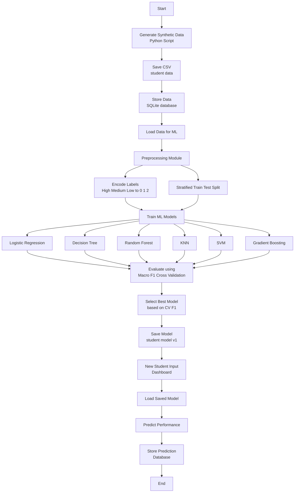
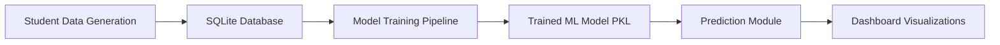
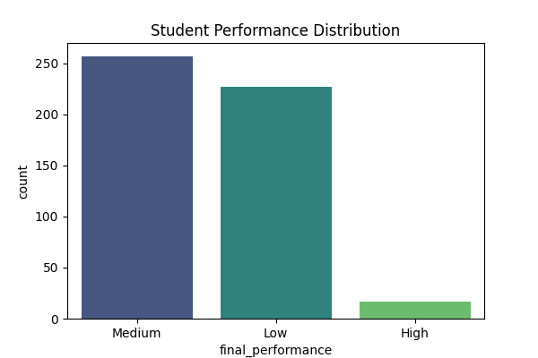
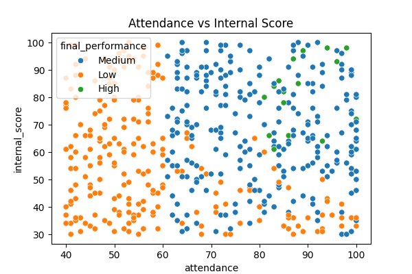
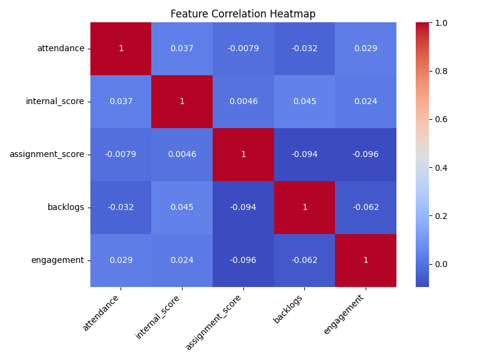

# 🎓 Student Academic Performance Prediction System

## 📌 Problem Statement
Universities often struggle to identify students who may be at academic risk early enough for effective intervention. Academic performance depends on multiple factors such as attendance, internal assessments, assignments, and engagement.

## 🎯 Project Goal
Build a **machine learning system** that predicts student performance (High / Medium / Low) and provides a dashboard for analytics and real-time prediction.

---

## 🧠 System Overview

1. Data generation and storage in SQLite  
2. ML training pipeline with multiple models  
3. Prediction system using best model  
4. Dashboard for visualization and input  

---

## 🛠 Tech Stack

| Component | Technology |
|----------|------------|
Python | Core language  
Database | SQLite  
ML | Scikit-learn, Pandas, NumPy  
Serialization | Joblib  
Dashboard | React + TypeScript  
Charts | Recharts  
Version Control | Git & GitHub  
Backend API | FastAPI + Uvicorn

---

## 🚀 Backend API Setup

The system includes a **FastAPI backend** that serves the trained Machine Learning model and enables real-time student performance predictions for the dashboard.

---

## 📦 Starting the Backend

| Step | Command |
|-----|-----|
| Navigate to backend folder | `cd backend` |
| Install dependencies | `pip install -r requirements.txt` |
| Start FastAPI server | `uvicorn main:app --reload --host 0.0.0.0 --port 8000` |

### Alternative Command (Run from project root)

| Command |
|------|
| `python -m uvicorn backend.main:app --reload --host 0.0.0.0 --port 8000` |

---

## 🌐 API Endpoints

| Method | Endpoint | Description |
|------|------|------|
| GET | `/health` | Checks API health and verifies if the ML model is loaded |
| POST | `/predict` | Generates student performance prediction using the trained ML model |

---

## 📥 Prediction Request Format

### Endpoint
`POST /predict`

### Request Parameters

| Parameter | Type | Range | Description |
|------|------|------|------|
| attendance | integer | 0 – 100 | Student attendance percentage |
| testScore | integer | 0 – 100 | Internal test score |
| assignmentScore | integer | 0 – 100 | Assignment score |
| backlogs | integer | 0 – 10 | Number of pending backlogs |
| engagement | integer | 0 – 100 | Student engagement score |

### Example Request

```json
{
  "attendance": 85,
  "testScore": 78,
  "assignmentScore": 80,
  "backlogs": 0,
  "engagement": 90
}
```

---

## 📤 Prediction Response Format

### Response Fields

| Field | Type | Description |
|------|------|------|
| level | string | Predicted performance category (High / Medium / Low) |
| confidence | float | Model confidence score in percentage |
| recommendations | array | List of improvement recommendations for the student |
| factors | array | Contributing factors influencing the prediction |

### Example Response

```json
{
  "level": "High",
  "confidence": 95.82,
  "recommendations": [...],
  "factors": [...]
}
```

---

## 🧠 API Architecture Overview

| Component | Description |
|------|------|
| FastAPI | Backend framework serving the ML model |
| Random Forest Classifier | Trained machine learning model used for predictions |
| Label Encoder | Converts encoded labels into readable performance categories |
| React Dashboard | Frontend interface that interacts with the API |

---

## 🩺 Health Check Endpoint

| Endpoint | Purpose |
|------|------|
| `/health` | Confirms backend status and verifies that the ML model is loaded |

Example Response:

```json
{
  "status": "healthy",
  "model_loaded": true
}
```

---

# 🔄 ML Pipeline



---


## 📁 Project Folder Structure

```
Hackathon_3/
│
├── backend/                 # FastAPI backend serving the ML model
│
├── Dashboard_Hackathon3/    # React dashboard for analytics and predictions
│
├── data_generator/          # Synthetic student data generation scripts
│
├── database/                # SQLite database utilities and data storage
│
├── model_training/          # ML training pipeline and model evaluation
│
├── preprocessing/           # Data preprocessing and feature preparation
│
├── saved_models/            # Trained ML models stored as .pkl files
│
├── scripts/                 # Utility scripts for prediction and database operations
│
├── Visualizations/          # Generated charts, plots, and analytics visuals
│
├── students.db              # SQLite database containing student records
│
├── student_data.csv         # Generated synthetic dataset
│
├── pipeline.md              # Documentation for ML pipeline
│
└── README.md                # Project documentation
```

---

## 📂 Folder Description

| Folder | Purpose |
|------|------|
| `backend/` | FastAPI backend used to serve the trained ML model and provide prediction APIs |
| `Dashboard_Hackathon3/` | React + TypeScript dashboard used for visualization, analytics, and prediction interface |
| `data_generator/` | Scripts used to generate synthetic student academic data |
| `database/` | Utilities for storing and retrieving data from the SQLite database |
| `model_training/` | Machine learning training pipeline including model selection and evaluation |
| `preprocessing/` | Data preprocessing module handling feature preparation and dataset splitting |
| `saved_models/` | Serialized trained ML models saved using Joblib |
| `scripts/` | Utility scripts for predictions, database checks, and automation |
| `Visualizations/` | Generated plots and visual analytics outputs |
| `students.db` | SQLite database containing student performance records |
| `student_data.csv` | Raw generated dataset used for training |
| `pipeline.md` | Documentation explaining the ML workflow pipeline |
| `README.md` | Main documentation file for the repository |

---

## Data Pipeline

Student data is generated using a Python script

Data is stored in a SQLite database

The ML model is trained using this database

The trained model is saved for future predictions

New prediction inputs can be added to the database for future retraining

 ## Model Lifecycle

Initial model is trained on historical academic data

New student prediction records can be stored

Model can be periodically retrained with updated data

Versioned models can be maintained for comparison

 ## Dashboard Features

Overview statistics (total students, average scores, performance distribution)

Scatter plots and performance analytics

Interactive student performance prediction form

Model information and performance metrics display


---

## 🔄 System Workflow




## 📊 Data Visualizations

**These visualizations are generated from the student dataset and help in understanding performance patterns and relationships between different academic factors.**

### Performance Distribution


This chart shows how students are distributed across the three performance categories:

High Performance

Medium Performance

Low Performance

It helps quickly understand the overall academic standing of the student population.

### Attendance vs Internal Score


This scatter plot visualizes the relationship between attendance percentage and internal test scores.

Each point represents a student

Helps identify trends between classroom presence and academic performance

Useful for spotting students at academic risk

### Feature Correlation Heatmap


This heatmap shows the correlation between all major academic features used in the model:

Attendance

Internal Score

Assignment Score

Backlogs

Engagement

Darker shades indicate stronger relationships (positive or negative).
This helps understand how different academic factors influence each other.