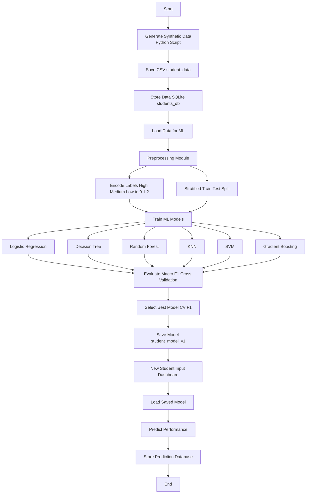
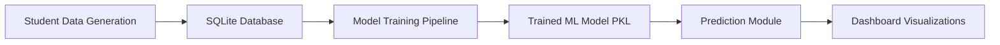

# 🎓 Student Academic Performance Prediction System

## 📌 Problem Statement
Universities often struggle to identify students who may be at academic risk early enough for effective intervention. Academic performance depends on multiple factors such as attendance, internal assessments, assignments, and engagement. Manual tracking of these patterns is difficult and time-consuming.

## 🎯 Project Goal
This project aims to build a **machine learning–powered system** that predicts a student's final academic performance (High / Medium / Low) using key academic indicators. The system also provides a dashboard for analyzing trends and making real-time predictions.

---

## 🧠 System Overview

This system consists of:

1. **Data Generation & Storage** – Student academic records stored in an SQL database  
2. **Model Training Pipeline** – Traditional ML models trained on academic features  
3. **Prediction System** – Uses trained model to predict student performance  
4. **Dashboard/UI** – Visualizes data trends and allows interactive predictions  

---

## 🛠 Tech Stack

| Component | Technology |
|----------|------------|
| Programming Language | Python |
| Database | SQLite |
| ML Libraries | Scikit-learn, Pandas, NumPy |
| Model Serialization | Joblib |
| Dashboard | React + TypeScript (Vite) |
| Charts | Recharts |
| Version Control | Git & GitHub |

---


```markdown

## Pipeline



## 📁 Project Folder Structure


project/
│
├── data_generator/ # Scripts to generate synthetic student data
├── database/ # Scripts to create and manage SQLite DB
├── scripts/ # Utility & testing scripts
├── models/ # Saved trained ML models (.pkl)
├── dashboard/ # React frontend dashboard
└── README.md

## Data Pipeline

Student data is generated using a Python script

Data is stored in a SQLite database

The ML model is trained using this database

The trained model is saved for future predictions

New prediction inputs can be added to the database for future retraining

 ## Model Lifecycle

Initial model is trained on historical academic data

New student prediction records can be stored

Model can be periodically retrained with updated data

Versioned models can be maintained for comparison

 ## Dashboard Features

Overview statistics (total students, average scores, performance distribution)

Scatter plots and performance analytics

Interactive student performance prediction form

Model information and performance metrics display


---

## 🔄 System Workflow




## 📊 Data Visualizations

**These visualizations are generated from the student dataset and help in understanding performance patterns and relationships between different academic factors.**

### Performance Distribution


This chart shows how students are distributed across the three performance categories:

High Performance

Medium Performance

Low Performance

It helps quickly understand the overall academic standing of the student population.

### Attendance vs Internal Score


This scatter plot visualizes the relationship between attendance percentage and internal test scores.

Each point represents a student

Helps identify trends between classroom presence and academic performance

Useful for spotting students at academic risk

### Feature Correlation Heatmap


This heatmap shows the correlation between all major academic features used in the model:

Attendance

Internal Score

Assignment Score

Backlogs

Engagement

Darker shades indicate stronger relationships (positive or negative).
This helps understand how different academic factors influence each other.