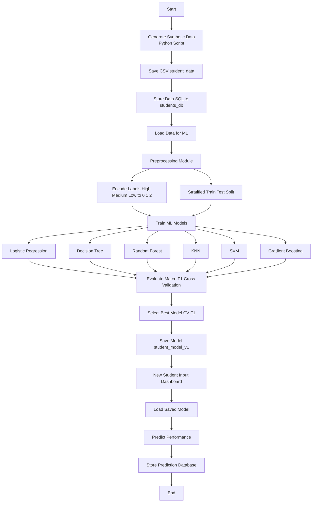

```mermaid
flowchart TD

A[Start] --> B[Generate Synthetic Data\nPython Script]
B --> C[Save CSV student_data]
C --> D[Store Data SQLite students_db]
D --> E[Load Data for ML]

E --> F[Preprocessing Module]
F --> F1[Encode Labels High Medium Low to 0 1 2]
F --> F2[Stratified Train Test Split]

F1 --> G
F2 --> G

G[Train ML Models]

G --> H1[Logistic Regression]
G --> H2[Decision Tree]
G --> H3[Random Forest]
G --> H4[KNN]
G --> H5[SVM]
G --> H6[Gradient Boosting]

H1 --> I[Evaluate Macro F1 Cross Validation]
H2 --> I
H3 --> I
H4 --> I
H5 --> I
H6 --> I

I --> J[Select Best Model CV F1]

J --> K[Save Model student_model_v1]
K --> L[New Student Input Dashboard]
L --> M[Load Saved Model]
M --> N[Predict Performance]
N --> O[Store Prediction Database]
O --> P[End]
```